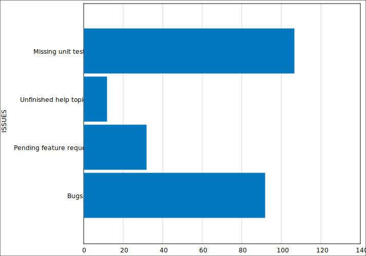
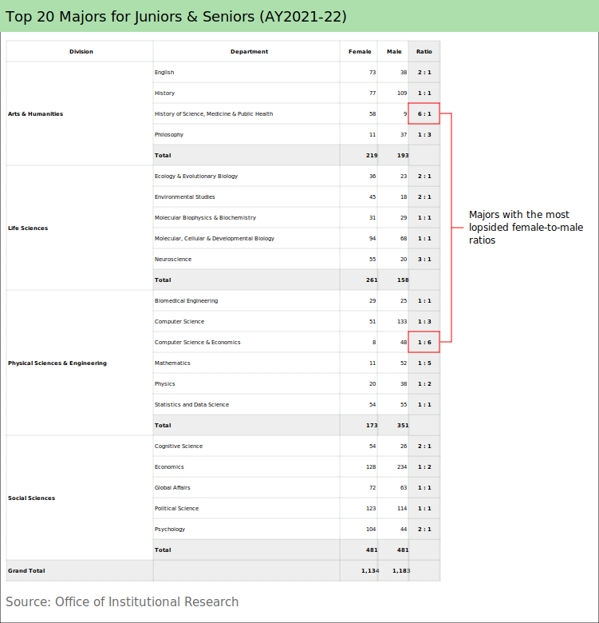
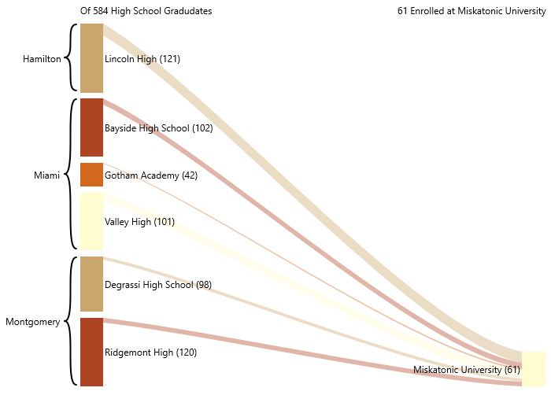
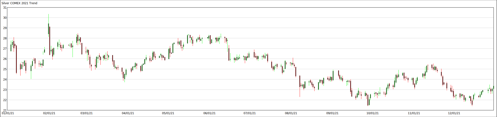
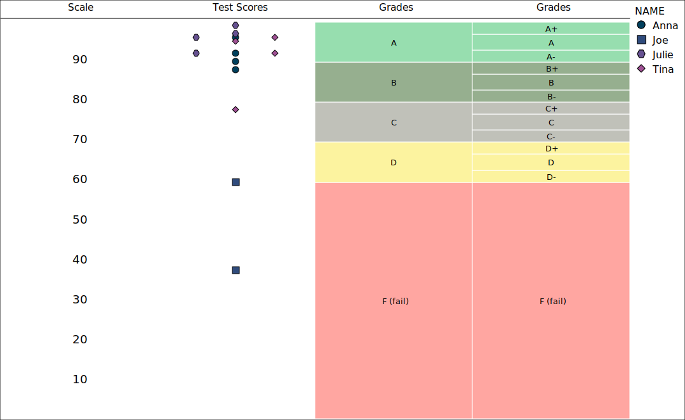

Graphs Gallery
=============================
[TOC]

Basic
-----------------------------

| Bar Chart (Wisteria::Graphs::BarChart) | Stylized Bar Chart (Wisteria::Graphs::BarChart) |
| :-------------- | :-------------- |
|  |  |

| Image-based Bar Chart (Wisteria::Graphs::BarChart) |
| :-------------------------------- |
|  |

| Categorized Bar Chart (Wisteria::Graphs::CategoricalBarChart) | Categorized, Grouped Bar Chart (Wisteria::Graphs::CategoricalBarChart) |
| :-------------- | :-------------- |
|  |  |

| Categorized Bar Chart with Stipple Brush (Wisteria::Graphs::CategoricalBarChart) |
| :-------------------------------- |
|  |

| Categorized Bar Chart with Watercolor Effect (Wisteria::Graphs::CategoricalBarChart) |
| :-------------------------------- |
|  |

| Line Plot (Wisteria::Graphs::LinePlot) | Stylized Line Plot (Wisteria::Graphs::LinePlot) |
| :-------------------------------- | :-------------------------------- |
|  |  |

| Pie Chart (Wisteria::Graphs::PieChart) | Pie Chart with Subgroups (Wisteria::Graphs::PieChart) |
| :-------------------------------- | :-------------------------------- |
|  |  |

| Donut Chart (Wisteria::Graphs::PieChart) | Donut Chart with Subgroups (Wisteria::Graphs::PieChart) |
| :-------------------------------- | :-------------------------------- |
|  |  |

| Styled Pie Charts | |
| :-------------- | :-------------------------------- |
|  |  |
|  |  |

| Table (Wisteria::Graphs::Table) |
| :-------------- |
|  |

| Sankey Diagram (Wisteria::Graphs::SankeyDiagram) |
| :-------------- |
|  |

| Waffle Chart (Wisteria::Graphs::WaffleChart) |
| :-------------- |
|  |

| Word Cloud (Wisteria::Graphs::WordCloud) |
| :-------------- |
|  |

Business
-----------------------------

| Gantt Chart (Wisteria::Graphs::GanttChart) |
| :-------------------------------- |
|  |

| Candlestick Plot (Wisteria::Graphs::CandlestickPlot) |
| :-------------------------------- |
|  |

Statistical
-----------------------------

| Histogram (Wisteria::Graphs::Histogram) | Grouped Histogram (Wisteria::Graphs::Histogram) |
| :-------------- | :-------------- |
|  |  |

| Box Plot (Wisteria::Graphs::BoxPlot) | Grouped Box Plot (Wisteria::Graphs::BoxPlot) |
| :-------------- | :-------------------------------- |
|  |  |

| Discrete Heat Map (Wisteria::Graphs::HeatMap) | Grouped Discrete Heat Map (Wisteria::Graphs::HeatMap) |
| :-------------- | :-------------------------------- |
|  |  |

Survey Data
-----------------------------

| 3-Point Likert Chart (Wisteria::Graphs::LikertChart) |
| :-------------- |
|  |

| 7-Point Likert Chart (Wisteria::Graphs::LikertChart) |
| :-------------- |
|  |

| Pro & Con Roadmap (Wisteria::Graphs::ProConRoadmap) |
| :-------------- |
|  |

Education
-----------------------------

| Scale Chart (Wisteria::Graphs::ScaleChart) |
| :-------------- |
|  |

Social Sciences
-----------------------------

| W-Curve Plot (Wisteria::Graphs::WCurvePlot) |
| :-------------- |
|  |

| Linear Regression Roadmap (Wisteria::Graphs::LRRoadmap) |
| :-------------- |
|  |

| Linear Regression Roadmap (Wisteria::Graphs::LRRoadmap) |
| :-------------- |
|  |

Sports
-----------------------------

| Win/Loss Sparkline (Wisteria::Graphs::WinLossSparkline) |
| :-------------- |
|  |

Readability Formulas
-----------------------------

| Lix Gauge (Wisteria::Graphs::LixGauge) | German Lix Gauge (Wisteria::Graphs::LixGaugeGerman) |
| :-------------- | :-------------- |
|  |  |

| Danielson-Bryan 2 Plot (Wisteria::Graphs::DanielsonBryan2Plot) | Crawford Graph (Wisteria::Graphs::CrawfordGraph) |
| :-------------- | :-------------- |
|  |  |

| Flesch Reading Ease Chart (Wisteria::Graphs::FleschChart) |
| :-------------- |
|  |

Multi-plot Layouts
-----------------------------

| Multiple Plots | Multiple Plots with a Common Axis |
| :-------------- | :-------------- |
|  |  |
