Wisteria Dataviz
=============================


[](https://github.com/Blake-Madden/Wisteria-Dataviz/actions/workflows/unix%20build.yml)
[](https://github.com/Blake-Madden/Wisteria-Dataviz/actions/workflows/macos-build.yml)

[](https://github.com/Blake-Madden/Wisteria-Dataviz/actions/workflows/cppcheck.yml)
[](https://github.com/Blake-Madden/Wisteria-Dataviz/actions/workflows/msvc.yml)

[](https://github.com/Blake-Madden/Wisteria-Dataviz/actions/workflows/doxygen.yml)
[](https://github.com/Blake-Madden/Wisteria-Dataviz/actions/workflows/i18n-check.yml)
[](https://github.com/Blake-Madden/Wisteria-Dataviz/actions/workflows/spell-check.yml)

About
=============================

Wisteria Dataviz is data visualization library based on [wxWidgets](https://github.com/wxWidgets/wxWidgets). It includes features
such as:

- Numerous built-in graphs (refer to the `Wisteria::Graphs` namespace for a full list)
- Interface for displaying tabular data
- Built-in [printing](Printing.md), copying, and exporting support
- Data [importing](ImportingData.md) (Excel, CSV, tab-delimited, or user-defined delimited files) support
- Data [transformations](TransformingData.md), such as filtering, pivoting (both longer or wider), subsetting, and recoding
- Data exporting (CSV, tab-delimited, or user-defined delimited files) support
- [Image](Images.md) support, including the ability to use images for plot and bar backgrounds, logos, and point markers
- Image effects, such as oil-painting and Sepia tone
- Effects for boxes and bars, including transparency, a watercolor look, a glassy look, stipple brushes, and color fades
- Reference lines and areas
- Pre-defined and extensible color schemes
- Multi-plot support
  - Graphs can be embedded side-by-side on the same (scrollable) canvas
  - Includes support for setting a common axis for all graphs across a row or down a column

See more in the [features overview](Features.md).
  
General Workflow
=============================

- Setup the [library's settings](Setup.md) (optionally) when your application starts
- Construct a `Wisteria::Canvas` object (which is a `wxScrolledWindow`-derived window), and embed it into
a `wxFrame` or `wxDialog`
- [Import data](ImportingData.md) into a `Wisteria::Data::Dataset` (or [build](BuildingData.md) a dataset),
specifying which columns to include and how to classify them
- Construct a plot object (e.g., `Wisteria::Graphs::LinePlot`) and pass your dataset to it
- Customize the plot, as needed
  - Change the colors and styles of the bars, lines, etc.
  - Change the plot background color, or use an image as the background
  - Add titles and captions
  - Adjust the [axes](Axes.md), add tickmarks, add custom [labels](Labels.md)
  - etc.
- Add the plot (and its legend [if applicable]) to the canvas

Graph Types
=============================

Some of the graphs included are:

Basic
-----------------------------

| Bar Chart (Wisteria::Graphs::BarChart) | Line Plot (Wisteria::Graphs::LinePlot) |
| :-------------- | :-------------- |
| 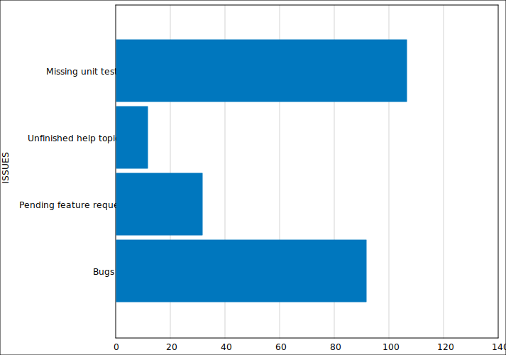 | 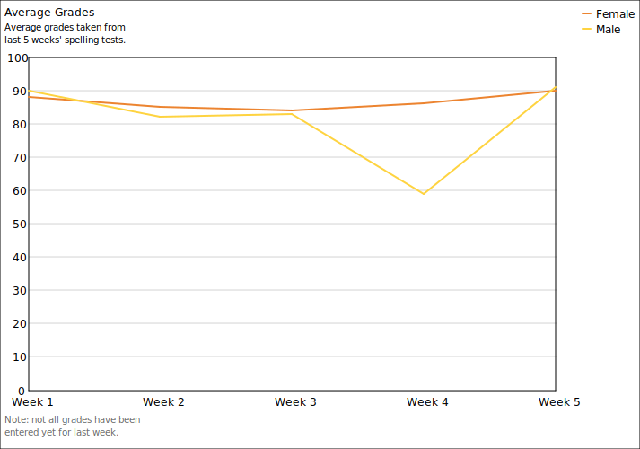 |

| Pie Chart (Wisteria::Graphs::PieChart) | Donut Chart (Wisteria::Graphs::PieChart) |
| :-------------------------------- | :-------------------------------- |
| 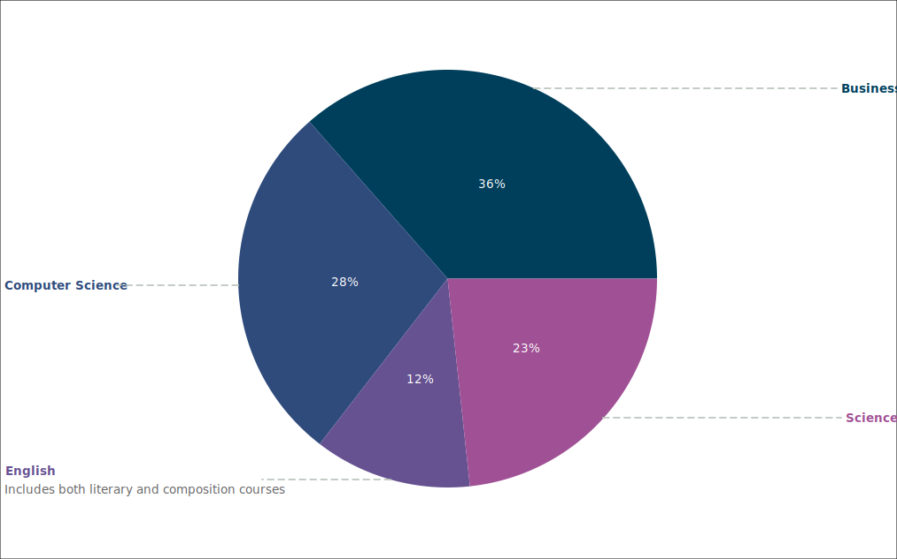 | 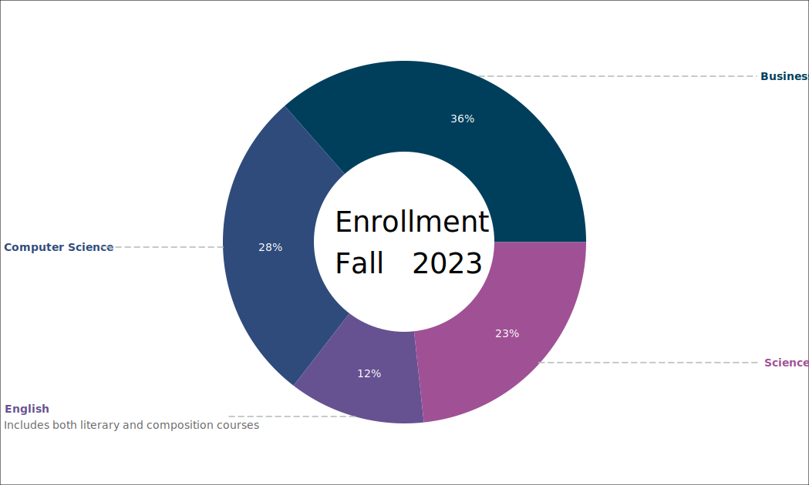 |

| Table (Wisteria::Graphs::Table) |
| :-------------- |
|  |

| Sankey Diagram (Wisteria::Graphs::SankeyDiagram) |
| :-------------- |
| 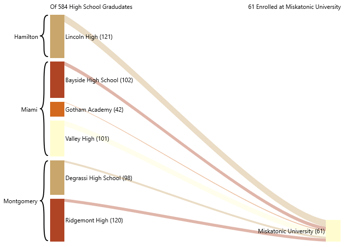 |

| Word Cloud (Wisteria::Graphs::WordCloud) |
| :-------------- |
| 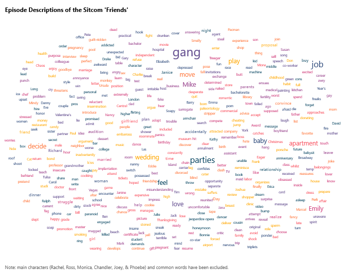 |

Business
-----------------------------

| Gantt Chart (Wisteria::Graphs::GanttChart) |
| :-------------------------------- |
| 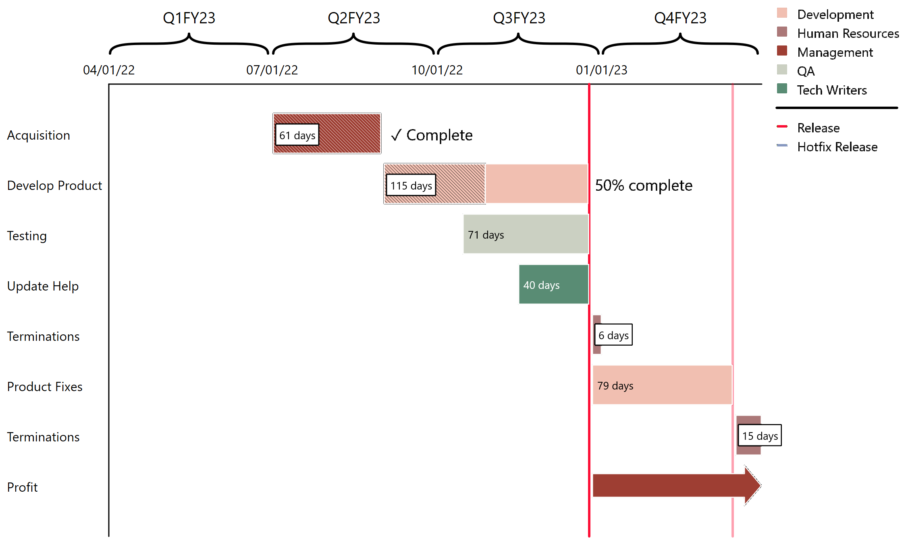 |

| Candlestick Plot (Wisteria::Graphs::CandlestickPlot) |
| :-------------------------------- |
| 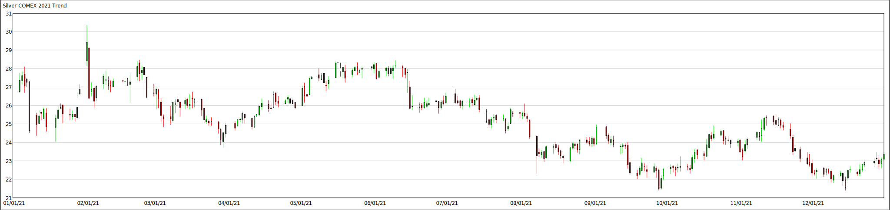 |

Statistical
-----------------------------

| Histogram (Wisteria::Graphs::Histogram) | Box Plot (Wisteria::Graphs::BoxPlot) |
| :-------------- | :-------------- |
| 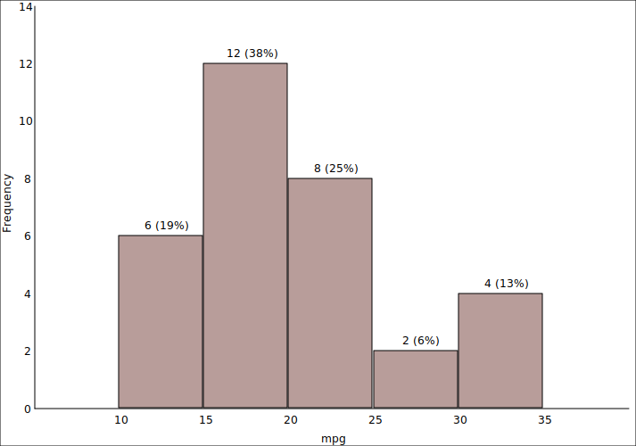 | 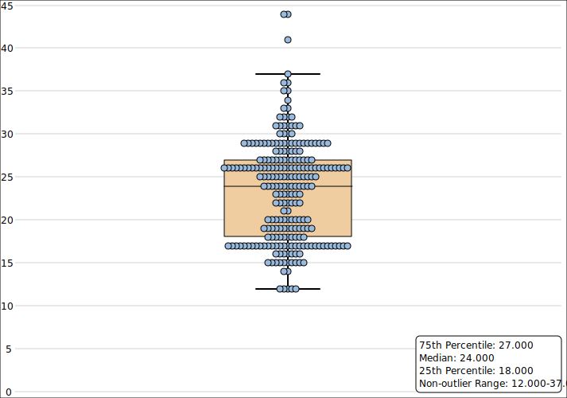 |

| Discrete Heat Map (Wisteria::Graphs::HeatMap) | Grouped Discrete Heat Map (Wisteria::Graphs::HeatMap) |
| :-------------- | :-------------------------------- |
| 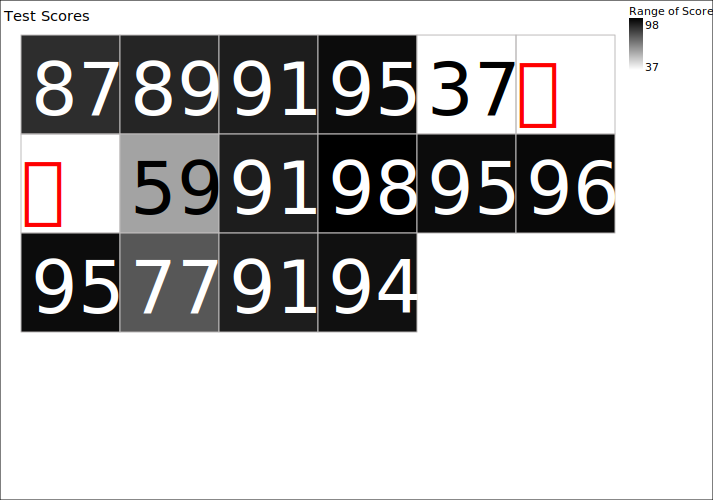 | 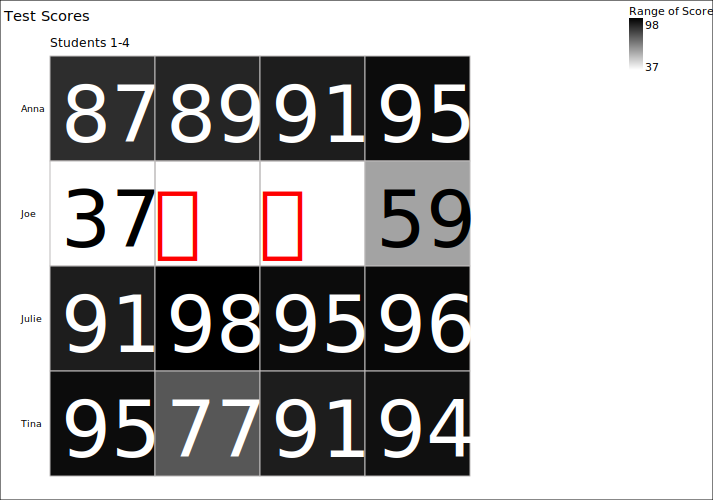 |

Survey Data
-----------------------------

| 3-Point Likert Chart (Wisteria::Graphs::LikertChart) |
| :-------------- |
| 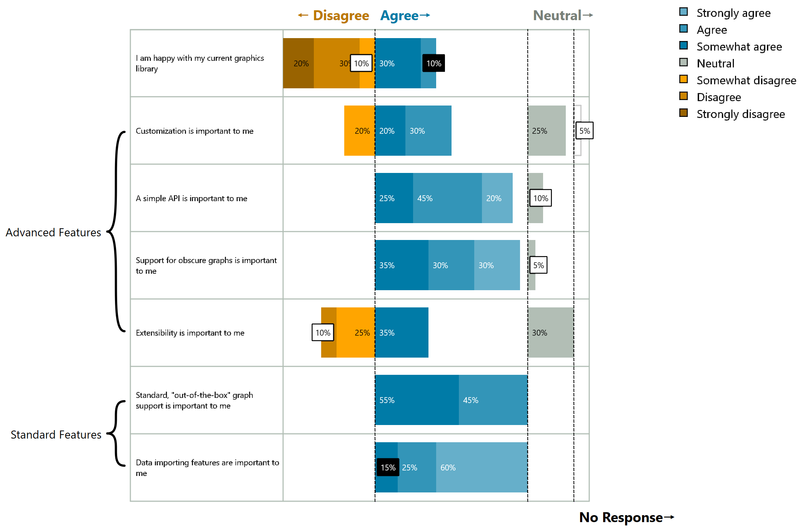 |

| Pro & Con Roadmap (Wisteria::Graphs::ProConRoadmap) |
| :-------------- |
| 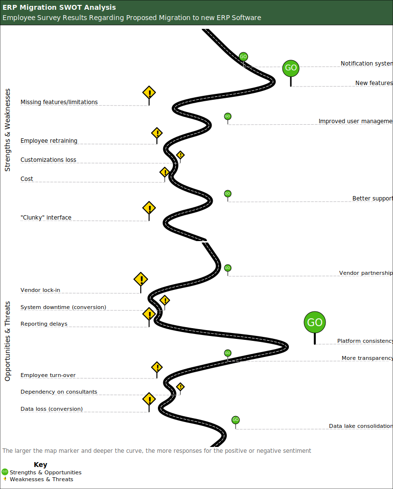 |

Social Sciences
-----------------------------

| W-Curve Plot (Wisteria::Graphs::WCurvePlot) |
| :-------------- |
| 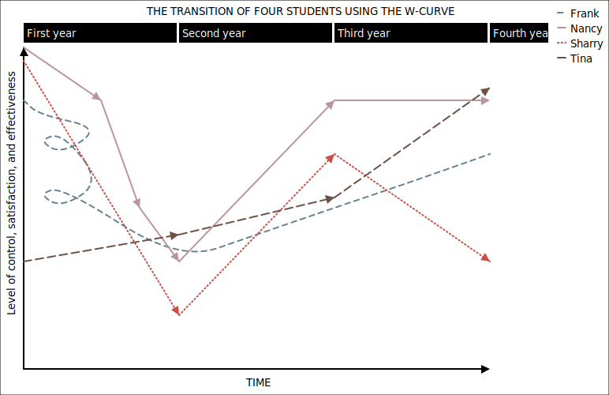 |

| Linear Regression Roadmap (Wisteria::Graphs::LRRoadmap) |
| :-------------- |
| 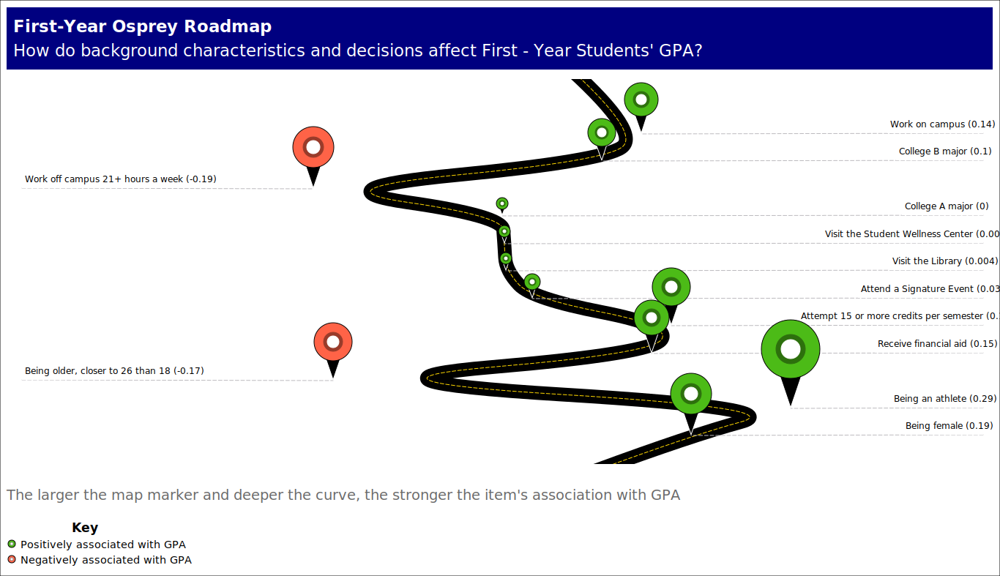 |

See more in the [graphs gallery](Gallery.md).

Release Notes
=============================
Release information is available [here](Release.md).

Building
=============================

First, download Wisteria:

```
git clone https://github.com/Blake-Madden/Wisteria-Dataviz.git --recurse-submodules
```

Windows
-----------------------------

Get and build [wxWidgets](https://github.com/wxWidgets/wxWidgets) 3.3 or higher at the
same folder level as this project:

- Open *Visual Studio* and select *Clone a Repository*
  - Enter "https://github.com/wxWidgets/wxWidgets.git" and clone it to same level as this project
- Once the wxWidgets folder is cloned and opened in *Visual Studio*:
  - Open **Project** > **CMake Settings for wxWidgets**
    - Uncheck **wxBUILD_SHARED**
    - Save your changes
  - Select **Build** > **Install wxWidgets** (builds and then copies the header, lib, and cmake files to the prefix folder)

Next, open the Wisteria folder in Visual Studio and build the project.

Linux
-----------------------------

Install the following from your repository manager (or build from source):

- GTK3 development files (version 3.3 or higher)
- Threading Building Blocks (libtbb) and its development files

Get and build [wxWidgets](https://github.com/wxWidgets/wxWidgets) 3.3 or higher at the
same folder level as this project:

```
git clone https://github.com/wxWidgets/wxWidgets.git --recurse-submodules
cmake . -DCMAKE_INSTALL_PREFIX=./wxlib -DwxBUILD_SHARED=OFF
cmake --build . --target install -j4
```

Go into the project folder and run the following to
build the library and demo:

```
cmake .
cmake --build . -j 4
```

If using KDevelop or VS Code, you can also open the CMake file and build from there.

macOS
-----------------------------

Install the following using brew (or build from source):

- Threading Building Blocks (tbb)
- OpenMP (libomp)
- Doxygen

Get and build [wxWidgets](https://github.com/wxWidgets/wxWidgets) 3.3 or higher at the
same folder level as this project:

```
git clone https://github.com/wxWidgets/wxWidgets.git --recurse-submodules
cmake . -DCMAKE_INSTALL_PREFIX=./wxlib -DwxBUILD_SHARED=OFF
cmake --build . --target install -j4
```

Go into the project folder and run the following to
build the library and demo:

```
cmake .
cmake --build . -j 4
```

Documentation
=============================

To build the API documentation, open "docs/doxygen/Doxyfile" in Doxygen and run it.

Dependencies
=============================

- [wxWidgets](https://github.com/wxWidgets/wxWidgets) 3.3 or higher
- GTK 3 (Linux)
- Threading Building Blocks: libtbb (Linux)
- A C++20 compatible compiler
- OpenMP (optional)
