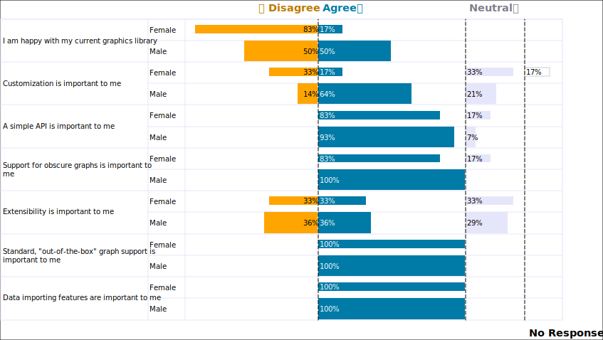

Wisteria Dataviz
=============================


About
=============================

Wisteria Dataviz is data visualization library based on [wxWidgets](https://github.com/wxWidgets/wxWidgets). It includes features
such as:

- Numerous built-in graphs (refer to the `Wisteria::Graphs` namespace for a full list)
- Built-in [printing](Printing.md) support
- Built-in copy support
- [Exporting](Exporting.md) (SVG, PNG, JPEG, GIF, BMP, TGA, and TIFF are supported)
- Mouse- and keyboard-enabled zooming
- Data [importing](ImportingData.md) and exporting (CSV, tab-delimited, or user-defined delimited files) support
- A dataset interface, which allows for easily connecting data to most graphs
  - Includes support for continuous, categorical, date, and ID columns
  - Graphs are designed to handle missing data
- Uses high-quality `wxGraphicsContext` for rendering (also uses Direct2D on Windows, if available)
- [Image](Images.md) support, including the ability to use images for plot and bar backgrounds
- Effects for boxes and bars, including transparency, a glassy look, stipple brushes, and color fades
- HiDPI display support (Windows)
- Customizable point markers and line styles
  - Pre-defined and extensible shape schemes
- Customizable [axes](Axes.md)
  - Ranges can be adjusted
  - Supports date ranges
  - Supports logarithmic scales
  - Labels can be stacked, hidden, replaced with custom text, etc.
  - Header and footers can be added
  - Tickmarks can be customized
  - Axis lines can be drawn as a regular line or an arrow
- Custom axes can be added onto the plot area (inside of the main axes)
- Reference lines
- Reference areas (e.g., recession areas on a financial chart)
- Legends with shape, image, and color scale support
- Extensive list of pre-built colors that can be referenced via an enumeration (`Wisteria::Colors::Color`)
- A [color brewing](Colors.md) interface, which is helpful for:
  - Building color scales
  - Shading or tinting colors
  - Selecting black or white (e.g., for a font color), depending on which better contrasts against the background color
- Pre-defined and extensible color schemes
- Multi-plot support
  - Graphs can be embedded side-by-side on the same (scrollable) canvas
  - Includes support for setting a common axis for all graphs across a row or down a column
  - The size proportions of the rows and columns within the canvas can be customized
- Annotations support; story-telling notes can be added to a plot with an arrow pointing to specific data points
- Text boxes that can be drawn vertically or horizontally
- Selectable objects; for example, selecting a bar on a bar chart can show a custom label
- Locale-sensitive number formatting (based on `wxUILocale`'s settings)
- An extensible framework for designing custom graphs
  - New graph types can be designed from the ground up or be derived from existing graph types (e.g., [BarChart](BarChart.md))
  - Uses an object-based API for positioning points, text boxes, polygons, lines, and images
  - Supports custom axes
  - Draw bounding boxes and extended information in debug mode (via `Wisteria::Settings::EnableDebugFlag()`)
  - Profiling macros (e.g., `PROFILE()`) to help with reviewing performance
  - i18n functions to help prevent accidental translations (e.g., `DONTTRANSLATE()` and `_DT()`)
  - `LogFile` class for routing logging information to a formatted file
  
General Workflow
=============================

- Setup the [library's settings](Setup.md) (optionally) when your application starts
- Construct a `Wisteria::Canvas` object (which is a `wxScrolledWindow`-derived window), and embed it into
a `wxFrame` or `wxDialog`
- [Import data](ImportingData.md) into a `Wisteria::Data::Dataset` (or [build](BuildingData.md) a dataset),
specifying which columns to include and how to classify them
- Construct a plot object (e.g., `Wisteria::Graphs::LinePlot`) and pass your dataset to it
- Customize the plot, as needed
  - Change the colors and styles of the bars, lines, etc.
  - Change the plot background color, or use an image as the background
  - Add titles and captions
  - Adjust the [axes](Axes.md), add tickmarks, add custom [labels](Labels.md)
  - etc.
- Add the plot (and its legend [if applicable]) to the canvas

Graph Types
=============================

Some of the graphs included are:

Basic
-----------------------------

| Bar Chart (Wisteria::Graphs::BarChart) | Line Plot (Wisteria::Graphs::LinePlot) |
| :-------------- | :-------------- |
|  |  |

| Pie Chart (Wisteria::Graphs::PieChart) | Donut Chart (Wisteria::Graphs::PieChart) |
| :-------------------------------- | :-------------------------------- |
|  |  |

Business
-----------------------------

| Gantt Chart (Wisteria::Graphs::GanttChart) |
| :-------------------------------- |
|  |

| Candlestick Plot (Wisteria::Graphs::CandlestickPlot) |
| :-------------------------------- |
|  |

Statistical
-----------------------------

| Histogram (Wisteria::Graphs::Histogram) | Box Plot (Wisteria::Graphs::BoxPlot) |
| :-------------- | :-------------- |
|  |  |

| Discrete Heat Map (Wisteria::Graphs::HeatMap) | Grouped Discrete Heat Map (Wisteria::Graphs::HeatMap) |
| :-------------- | :-------------------------------- |
|  |  |

Survey Data
-----------------------------

| 3-Point Likert Chart (Wisteria::Graphs::LikertChart) |
| :-------------- |
|  |

Social Sciences
-----------------------------

| W-Curve Plot (Wisteria::Graphs::WCurvePlot) |
| :-------------- |
|  |

See more in the [graphs gallery](Gallery.md).

Building
=============================

NOTE: A C++17 compatible compiler is required.

First, you will need to get and build [wxWidgets](https://github.com/wxWidgets/wxWidgets) (3.1.7 or higher is required):

```
git clone https://github.com/wxWidgets/wxWidgets.git --recurse-submodules
```

Refer [here](https://github.com/wxWidgets/wxWidgets/blob/master/README-GIT.md) for how to build wxWidgets.

Next, get and build Wisteria:

```
git clone https://github.com/Blake-Madden/Wisteria.git --recurse-submodules
```

To build the library and demo, you can use CMake (either directly or by using an IDE).

To build the API documentation, open "docs/doxygen/Doxyfile" in Doxygen and run it.

Windows
-----------------------------

On Windows, you will need to set `wxWidgets_ROOT_DIR` to the root folder where you have wxWidgets when
building with CMake.

Assuming that you had built wxWidgets in "C:/SRC/wxWidgets," you can pass this command line CMake:

```
-DwxWidgets_ROOT_DIR=C:/SRC/wxWidgets
```

Alternatively, if using Visual Studio, add this to your "CMakeSettings.json" file:

```
"cmakeCommandArgs": "-DwxWidgets_ROOT_DIR=C:/SRC/wxWidgets",
```

A note about using Visual Studio is that the output for the library is controlled in the "CMakeSettings.json"
file by these two items: `buildRoot` and `installRoot`. Adding these lines will specify to write the library
and demo into the project's "build" folder:

```
"buildRoot": "${workspaceRoot}\\build\\${name}",
"installRoot": "${workspaceRoot}\\build\\${name}",
```

Linux
-----------------------------

On Linux, you will need to set `wxWidgets_CONFIG_EXECUTABLE` to where wx-config is located.
Assuming that you had built wxWidgets in "/home/myname/wxWidgets/gtk-build," you can pass this command line
option to CMake:

```
-DwxWidgets_CONFIG_EXECUTABLE=/home/myname/wxWidgets/gtk-build/wx-config
```

If using KDevelop, go to `Project -> Open Configuration... -> Cmake` and you can edit this
variable there.

Dependencies
=============================

[wxWidgets](https://github.com/wxWidgets/wxWidgets) 3.1.7
